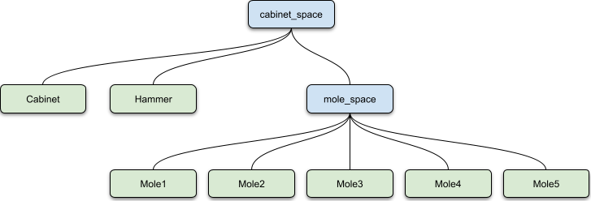
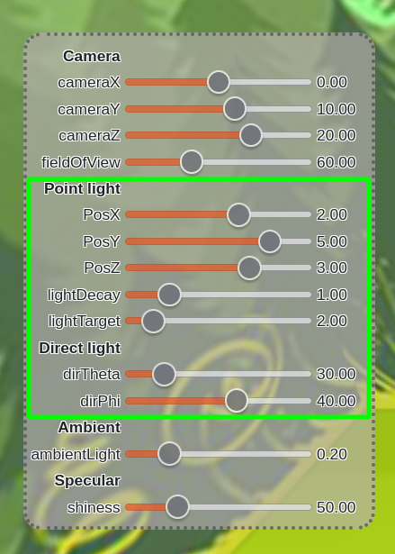
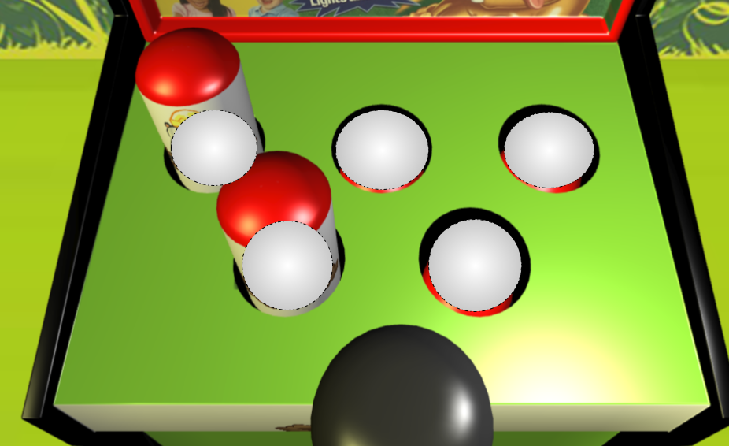

# Whack a mole

Computer Graphics mandatory project, Polimi a.y. 2020/2021

* Filippo Colombo
* Alessandro Molesti

---

# Program structure

This repository is used to implement a WebGL program whose code and sources are divided is folders, according to the type of source:
* `lib`, the folder containing the code scripts used to implement the overall program;  
* `asset`, which contains the graphic resources like the model of the objects and the textures;
* `shaders`, the folder that keeps the `GLSL` code used to render the scene.

Focusing on the content of the `lib` folder, here there is a brief description of each `.js` script:
* `script.js`, the main source of the program. Here there is all the code related to WebGL; 
* `game.js`, the code used to implement the logic of the game;
* `settings.js`, the source file used to keep the configuration of the parameters affecting the scene, which can be controlled by the user through the UI;
* `utils.js`, `webgl-obj-loader.js` are helper libraries used to perform mathematical operations on matrices and to load `.obj` models.  

To ease the readability and the implementation of the code, the `script.js` follows a functional approach. Here the key functions are given.
* `init()`: the entry point of the program. It is used to initialize the data structure used during the execution of the game and to load the external sources like the _mashes_ and the _shaders_. In turn, it executes the following functions: 
    * `loadObjects()`, which is used to define a VAO data structure for each mesh that has been loaded;
    * `sceneGraphDefinition()`, which initializes the scene graph, the data structure that collects the relationships between objects to be rendered.
* `render()`: the function used to draw objects on screen. To do so, it requires the computation of the lights parameters and all the matrices:
    * `lightDefinition()` is the function which computes the parameters of the lights by using the settings that the user can determine through the UI;
    * `setMatrices()` and `animate()` are the functions used to update the camera and the projection matrices, and to update the matrices of the objects stored in the scene graph that are supposed to move during time;
    * `drawScene()`, the function that actually performs the steps required to draw the objects.

# Game Logic

The logic of the game is specified in `game.js`.
Once the game is started, the user has to whack a set of moles that randomly move up and down from a game cabinet. He/she gets a point each time a mole is whacked, while he loses one life (of three) if he tries to whack a mole that is not visible (sleeping). The game ends when the user has no more lives.  
Practically the code instantiates a `Game` object which contains parameters like the score, the actual number of lives, and a set of moles. Each mole is defined through the `Mole` object which is the key component of the logic of the game. 
Each `Mole` object has a state representing the instantaneous behavior of the mole (asleep vs awake) and, once initialized, a timer that is characterized by a random time duration is used to swap the status.
Timers go on iteratively, each time with random time lengths.       

# Scene definition

The objects to draw and their relationships are defined by using a graph data structure which is initialized when the program starts.
The user's point of view is determined by the camera. 

## Scene graph

Here a visual representation of the graph:

Each node of the graph is characterized by a shader program that will be used in the rendering stage, a local matrix, and a world matrix.
The world matrix is iteratively computed from the root, by multiplying the local matrix of the current node by the world matrix of the parent node.

## Camera

The view model which is adopted is the _LookAt_-model: the camera keeps track of an object/point located in _(dx, dy, dz)_.
In our game the camera keeps track of the center position of the upper part of the cabinet: the position where are placed the holes from which the moles jump up and down. 

# Light model and shaders implementations
The scene is illuminated by 2 light sources: a direct light and a point light. Ambient light is used to cope with the pixels that are not subjected to any light source.
Location/direction and other parameters can be adjusted through the UI.

Among the shaders provided in the `shaders` folder the one used to render the objects in the scene is the one composed of `final_vs.glsl` and `final_fs.glsl`. The other pair of GLSL sources is the shader which deals with the representation of the skybox which simulates the surrounding environment.
The BRDF model used for rendering is characterized by a _Lambert diffuse reflection_ and a _Blinn specular reflection_.
Each of the two components can be sub-divided according to the contribution of the particular light source.

### Diffuse component
First define the base color of the pixel, which is retrieved by the texture.

__Point light__

Where __l__ is the point light color, __p__ the point light position and __n__ the normal relative to the pixel located in __x__.
Notice the _decay_ and _target_ parameters (_g_ and _beta_) used to scale the contibution of the point light color.

__Direct light__

Where __l__ is the direct light color, __d__ the light direction and __n__ the normal relative to the pixel located in __x__.

The overall _Lambert diffuse_ component of the BRDF is given by the sum of the 2 components:

### Specular component
The specular component of the BRDF even in this case can be split by considering the light source one at a time.
In both cases the contribution is determined by the following expression:

Where "omega" is the direction from which the object is seen, the exponent "gamma" is a parameter that rule the _shininess_, _lx_ is the light direction, whose computation differs according to the type of light source, and "__m__ s" is the specular color of the material.

__Point light__
In this case the ligth direction is computed as:

__Direct light__
In this case the direct light is not computed but directly provided as input (__d__).

The overall _Blinn specular reflection_ contribution is provided by the sum of the single component specific to the light source.

# Raycasting

To improve the gaming experience, the hole to select can be choosen using the mouse. To implement this feature raycasting is exploited.
The steps to determine the direction of the click performed by the user are the following:
1. Get the coordinates of the click, taking into account any possible displacement of the page;
2. Normalize the coordinates and project back the point on the near plane;
3. Get the direction related to the point (by setting the w component to 0) and determine the direction in world space by multiplying the direction by the inverse of the view matrix;

Now in order to determine if the computed direction is relative to one of the holes of the cabinet we consider the intersection of the ray with fictitious spheres placed in each hole.

To check if the user has actually selected a hole, these parameters are used:
* the _ray starting point_, which is the camera position;
* the _ray direction_, computed as specified above;multipling
* the _sphere center_, which is the hole position;
* the _spehere radius_, which is fixed during the execution. 

At each click all the holes of the cabinet are tested: if the ray hit one of the fictitious spheres the _whack_ routine is executed using as the identifier of the mole the hole the user hit.
If it is the case, the hammer animation starts, and either the score or the lives of the user are updated. 